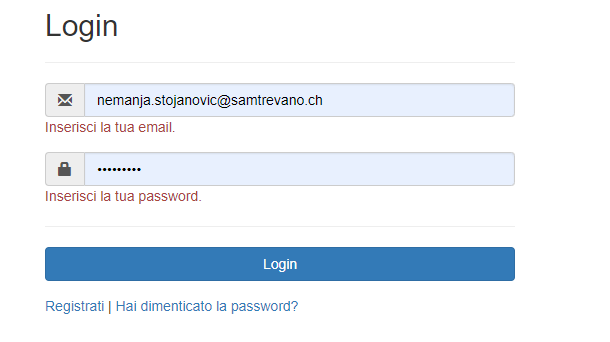

# Sito per la consultazione di progetti passati  
##### Peter Catania; Nemanja Stojanovic
### Diario di lavoro, Canobbio, 15 03 2019

## Lavori svolti

|Orario        |Lavoro svolto                 |
|--------------|------------------------------|
| 13:15 - 14:45 | **Peter**: Continuato il **REQ-03**  **Nemanja**: Continuato il **REQ-03**, ha cercato di risolvere il problema riscontrato visto nel capito sotto |
| 15:00 - 16:30 | **Peter**: Continuato il **REQ-03**  **Nemanja**: Continuato il **REQ-03**, ha cercato un nuovo modo per il ripristino della password |

##  Problemi riscontrati e soluzioni adottate
**Peter**: Il link della repo non viene salvato sul serve
**Nemanja**: Peter ha cercato di fare il login nel sito, solo che appareva l'errore seguente:

</img>

Ha cercato di trovare l'errore ma non l'ha trovato e quindi ha ripristinato tutte le pagine php, cancellando quelle che riguardano il ripristino delle password, le quali non funzionavano.

##  Punto della situazione rispetto alla pianificazione
Un po' indietro con l'implementazione

## Programma di massima per la prossima giornata di lavoro
Chiedere al sore come deve essere il download della documentazione. 
Chiedere al sore se il link della repository è obbligatorio o no, come sopecificato sulla descrizione di trello.
Chiedere riguardo alle domande sugli altri requisiti.
