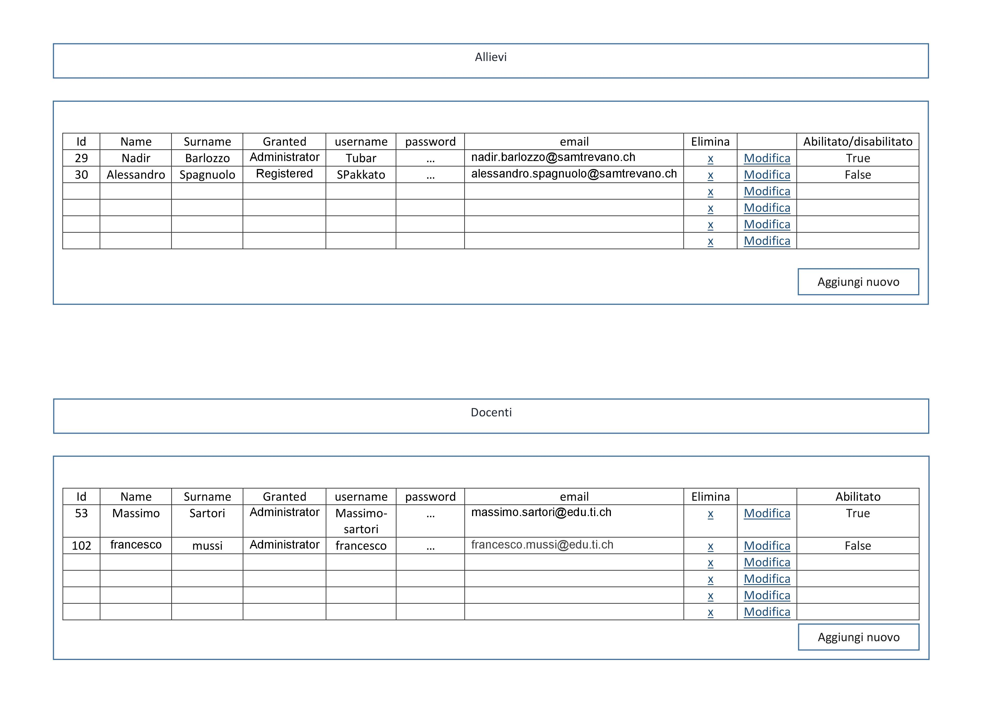

# Sito per la consultazione di progetti passati  
##### Peter Catania; Nemanja Stojanovic
### Diario di lavoro, Canobbio, 22 03 2019

## Lavori svolti

|Orario        |Lavoro svolto                 |
|--------------|------------------------------|
| 13:15 - 14:45 | **Peter**: Finito il **REQ-02**  **Nemanja**: Si è occupato di fare la progettazione che riguarda il **REQ-08**, quello dell'amministratore.      Infine ha aggiunto la progettazione nella documentazione con la descrizione. |
| 15:00 - 15:45 | **Peter**: Aggiunta la visualizzazione dell' link della repository del progetto e iniziato **REQ-08**  **Nemanja**: La prima ora ha iniziato l'implementazione del **REQ-08**.  |

##  Problemi riscontrati e soluzioni adottate
**Peter**: Risolto lo scorso problema, la variabile passata alla query non ere nel formato giusto.

##  Punto della situazione rispetto alla pianificazione
Un po' indietro con l'implementazione

## Programma di massima per la prossima giornata di lavoro
