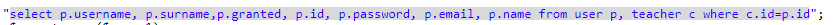
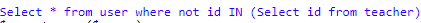
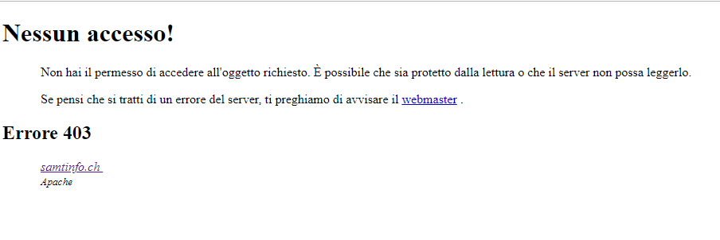

# Sito per la consultazione di progetti passati  
##### Peter Catania; Nemanja Stojanovic
### Diario di lavoro, Canobbio, 05 04 2019

## Lavori svolti

|Orario        |Lavoro svolto                 |
|--------------|------------------------------|
| 13:15 - 14:45 | **Peter:**  Sono andato avanti basandomi sul **REQ-7**, sono andato avanti con l'implementazione.   **Nemanja:**  Continuato **REQ-8**|
| 15:00 - 16:30 | **Peter:**  sono andato avanti basandomi sul **REQ-7**, ho fatto in modo che php creasse una nuova tabella dove visualizzare i file dove sono state trovate delle occorrenze, sono andato avanti con l'implementazione  **Nemanja:**  Continuato **REQ-8** |

##  Problemi riscontrati e soluzioni adottate
**Nemanja**: L'ultima volta avevo adottato un codice per ritornare gli allievi e i docenti separatamente:

Utilizzando questo metodo però stampava ogni record per 3 volte e a noi serve soltanto una volta. Provando tanti metodi ha trovato la soluzione Utilizzando la seguente query:

 
Un altro problema riscontrato è stato quando ha implementato la funzionalità che elimina un'utente.

Questo pezzo di codice genera il seguente errore:

Bisogna capire come risolvere il problema

##  Punto della situazione rispetto alla pianificazione
Un po' indietro con l'implementazione

## Programma di massima per la prossima giornata di lavoro
**Nemanja**: Risolvere il problema della funzionalità elimina e implementare l'aggiunta di un docente/allievo e la modifica dei dati.
