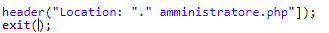
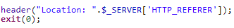

# Sito per la consultazione di progetti passati  
##### Peter Catania; Nemanja Stojanovic
### Diario di lavoro, Canobbio, 10 04 2019

## Lavori svolti

|Orario        |Lavoro svolto                 |
|--------------|------------------------------|
| 13:15 - 14:45 | **Peter:**  Sono andato avanti basandomi sul **REQ-7**, sono andato avanti con l'implementazione, ho cercato un modo per adottare il metodo trovato nella scorsa lezione, ma non sono riuscito a fargli fare quello che doveva fare, quindi ho cercato un altro metodo.  Ho Trovato questa soluzione:   https://stackoverflow.com/questions/6999889/how-to-extract-text-from-the-pdf-document   https://pastebin.com/dvwySU1a   **Nemanja:**  Continuato **REQ-8**|
| 15:00 - 16:30 | **Peter:**  sono andato avanti basandomi sul **REQ-7**, ho utilizzato la nuova soluzione per estrarre il testo dai file pdf.    $a = new PDF2Text(); $a->setFilename($doc_path);  $a->decodePDF();  $doc_text = $a->output();   **Nemanja:**  Continuato **REQ-8**, sta implementando la funzionalità aggiungi utente |

##  Problemi riscontrati e soluzioni adottate
**Nemanja**: Sono riuscito a risolvere il problema quando viene scelto di eliminare l'utente, così che ho cambiato l'header(), il quale fa in modo di ritornare alla pagina "amministratore.php"
Il codice che provocava l'errore è il seguente:
 
Poi ho risolto cambiando il codice:

##  Punto della situazione rispetto alla pianificazione
Un po' indietro con l'implementazione

## Programma di massima per la prossima giornata di lavoro
Continuare l'implementazione
