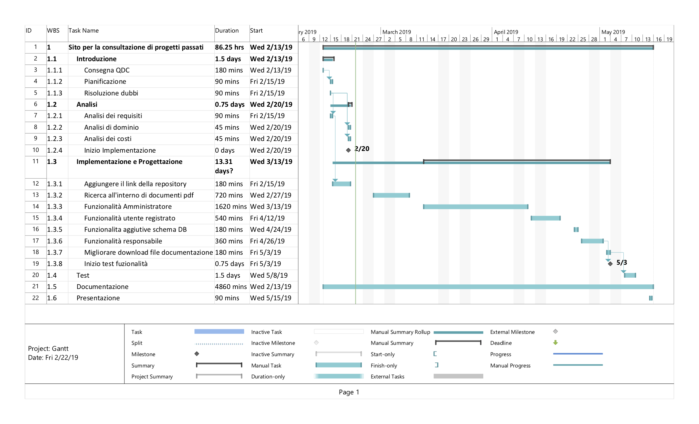

1. [Introduzione](#introduzione)

  - [Informazioni sul progetto](#informazioni-sul-progetto)

  - [Abstract](#abstract)

  - [Scopo](#scopo)

1. [Analisi](#analisi)

  - [Analisi del dominio](#analisi-del-dominio)

  - [Analisi dei mezzi](#analisi-dei-mezzi)

  - [Analisi e specifica dei requisiti](#analisi-e-specifica-dei-requisiti)

  - [Use case](#use-case)

  - [Pianificazione](#pianificazione)

1. [Progettazione](#progettazione)

  - [Design dell’architettura del sistema](#design-dell’architettura-del-sistema)

  - [Design dei dati e database](#design-dei-dati-e-database)

1. [Implementazione](#implementazione)

1. [Test](#test)

  - [Protocollo di test](#protocollo-di-test)

  - [Risultati test](#risultati-test)

  - [Mancanze/limitazioni conosciute](#mancanze/limitazioni-conosciute)

1. [Consuntivo](#consuntivo)

1. [Conclusioni](#conclusioni)

  - [Sviluppi futuri](#sviluppi-futuri)

  - [Considerazioni personali](#considerazioni-personali)

1. [Sitografia](#sitografia)

1. [Allegati](#allegati)

## Introduzione

### Informazioni sul progetto

  - <b>Titolo Progetto: </b>Sito per la consultazione di progetti passati

  - <b>Docente responsabile: </b>Luca Muggiasca

  - <b>Allievi responsabili: </b>Peter Catania, Nemanja Stojanovic

  - <b>Luogo di lavoro: </b>Scuola d’Arti e Mestieri Trevano, Aula 428

  - <b>Classe: </b>Peter Catania I3AC, Nemanja Stojanovic I3AA

  - <b>Materia: </b>Modulo 306

  - <b>Data di inizio: </b>2019.02.13

  - <b>Data di fine: </b>2019.05.17

### Abstract

  E’ una breve e accurata rappresentazione dei contenuti di un documento,
  senza notazioni critiche o valutazioni. Lo scopo di un abstract efficace
  dovrebbe essere quello di far conoscere all’utente il contenuto di base
  di un documento e metterlo nella condizione di decidere se risponde ai
  suoi interessi e se è opportuno il ricorso al documento originale.

  Può contenere alcuni o tutti gli elementi seguenti:

  -   **Background/Situazione iniziale**

  -   **Descrizione del problema e motivazione**: Che problema ho cercato
      di risolvere? Questa sezione dovrebbe includere l'importanza del
      vostro lavoro, la difficoltà dell'area e l'effetto che potrebbe
      avere se portato a termine con successo.

  -   **Approccio/Metodi**: Come ho ottenuto dei progressi? Come ho
      risolto il problema (tecniche…)? Quale è stata l’entità del mio
      lavoro? Che fattori importanti controllo, ignoro o misuro?

  -   **Risultati**: Quale è la risposta? Quali sono i risultati? Quanto è
      più veloce, più sicuro, più economico o in qualche altro aspetto
      migliore di altri prodotti/soluzioni?

  Esempio di abstract:

  > *As the size and complexity of today’s most modern computer chips
  > increase, new techniques must be developed to effectively design and
  > create Very Large Scale Integration chips quickly. For this project, a
  > new type of hardware compiler is created. This hardware compiler will
  > read a C++ program, and physically design a suitable microprocessor
  > intended for running that specific program. With this new and powerful
  > compiler, it is possible to design anything from a small adder, to a
  > microprocessor with millions of transistors. Designing new computer
  > chips, such as the Pentium 4, can require dozens of engineers and
  > months of time. With the help of this compiler, a single person could
  > design such a large-scale microprocessor in just weeks.*

### Scopo

  Migliorare il sito web già esistente, che permette di aggiungere e consultare i progetti creati nei vari anni scolastici

## Analisi

### Analisi del dominio

### Analisi e specifica dei requisiti

  |ID  |REQ-01                                        |
  |----|----------------------------------------------|
  |**Nome**    |Aggiungere funzionalità|
  |**Priorità**|1                     |
  |**Versione**|1.0                   |
  |**Note**    |Aggiungere funzionalità al sito web gia creato precedentemente, per la consultazione di progetti passati |
  |            |**Sotto requisiti** |
  |**001**      | Si sviluppano le funzionalità sul sito già esistente|
  |**002**      | Il sito permette di consultare i documenti elettronici dei progetti|
  |**003**      | Grazie ai campi si dovranno visualizzare i progetti in base alla ricerca.  |

  |ID  |REQ-02                                        |
  |----|----------------------------------------------|
  |**Nome**    |Possibilità di associare un link di un repository all'aggiunta di un progetto|
  |**Priorità**|1                     |
  |**Versione**|1.0                   |
  |**Note**    |Quando si aggiunge un progetto, deve esistere la possibilità di aggiungere anche il link ad una possibile repository su git.|
  |            |**Sotto requisiti** |
  |**001**      | Aggiungere alla tabella <b>project</b> del database <b>efof_lpiarch2018</b> la colonna "link_repo" |
  |**002**      | Nella sezione dove si può aggiunge un nuovo progetto, aggiungere all'iterfaccia poter aggiungere il link della repository del progetto|
  |**003**      | Aggiungere la funzinalità sul sito |

### Pianificazione

Appena iniziato il progetto mettiamo giù la pianificazione, per sapere come sarà svolto il progetto e subito dopo tutte le analisi sul progetto.
Dopo svolgiamo uno alla volta la pianificazione e poi l'implementazione di ogni modulo, testando pure il loro funzionamento individuale e tutti insieme all'interno del sito.

### Analisi dei mezzi

Elencare e *descrivere* i mezzi disponibili per la realizzazione del
progetto. Ricordarsi di sempre descrivere nel dettaglio le versioni e il
modello di riferimento.

SDK, librerie, tools utilizzati per la realizzazione del progetto e
eventuali dipendenze.

Su quale piattaforma dovrà essere eseguito il prodotto? Che hardware
particolare è coinvolto nel progetto? Che particolarità e limitazioni
presenta? Che hw sarà disponibile durante lo sviluppo?

## Progettazione

Questo capitolo descrive esaustivamente come deve essere realizzato il
prodotto fin nei suoi dettagli. Una buona progettazione permette
all’esecutore di evitare fraintendimenti e imprecisioni
nell’implementazione del prodotto.

### Design dell’architettura del sistema

Descrive:

-   La struttura del programma/sistema lo schema di rete...

-   Gli oggetti/moduli/componenti che lo compongono.

-   I flussi di informazione in ingresso ed in uscita e le
    relative elaborazioni. Può utilizzare *diagrammi di flusso dei
    dati* (DFD).

-   Eventuale sitemap

### Design dei dati e database

Basandosi sul <b>REQ-02</b> aggiungere la colonna <b>link-repo"</b> alla tabella "project".

project( 
&nbsp;&nbsp;&nbsp;&nbsp;&nbsp;&nbsp;id int(11), 
&nbsp;&nbsp;&nbsp;&nbsp;&nbsp;&nbsp;title varchar(40), 
&nbsp;&nbsp;&nbsp;&nbsp;&nbsp;&nbsp;description varchar(200), 
&nbsp;&nbsp;&nbsp;&nbsp;&nbsp;&nbsp;final_vote int(11), 
&nbsp;&nbsp;&nbsp;&nbsp;&nbsp;&nbsp;progress int(11), 
&nbsp;&nbsp;&nbsp;&nbsp;&nbsp;&nbsp;comment longtext, 
&nbsp;&nbsp;&nbsp;&nbsp;&nbsp;&nbsp;id_responsible int(11), 
&nbsp;&nbsp;&nbsp;&nbsp;&nbsp;&nbsp;doc_path varchar(260), 
&nbsp;&nbsp;&nbsp;&nbsp;&nbsp;&nbsp;<b>link_repo text</b> 
)

### Schema E-R, schema logico e descrizione.

Se il diagramma E-R viene modificato, sulla doc dovrà apparire l’ultima
versione, mentre le vecchie saranno sui diari.

### Design delle interfacce

Descrizione delle interfacce interne ed esterne del sistema e
dell’interfaccia utente. La progettazione delle interfacce è basata
sulle informazioni ricavate durante la fase di analisi e realizzata
tramite mockups.

### Design procedurale

Descrive i concetti dettagliati dell’architettura/sviluppo utilizzando
ad esempio:

-   Diagrammi di flusso e Nassi.

-   Tabelle.

-   Classi e metodi.

-   Tabelle di routing

-   Diritti di accesso a condivisioni …

Questi documenti permetteranno di rappresentare i dettagli procedurali
per la realizzazione del prodotto.

## Implementazione

## Test

### Protocollo di test

### Risultati test

### Mancanze/limitazioni conosciute

## Consuntivo

## Conclusioni

### Sviluppi futuri

### Considerazioni personali

### Sitografia

## Allegati

-   Diari di lavoro
