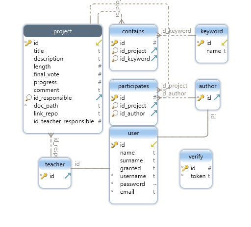

1. [Introduzione](#introduzione)

  - [Informazioni sul progetto](#informazioni-sul-progetto)

  - [Abstract](#abstract)

  - [Scopo](#scopo)

2. [Analisi](#analisi)

  - [Analisi del dominio](#analisi-del-dominio)

  - [Analisi dei mezzi](#analisi-dei-mezzi)

  - [Analisi e specifica dei requisiti](#analisi-e-specifica-dei-requisiti)

  - [Use case](#use-case)

  - [Pianificazione](#pianificazione)

3. [Progettazione](#progettazione)

  - [Design dell’architettura del sistema](#design-dell’architettura-del-sistema)

  - [Design dei dati e database](#design-dei-dati-e-database)

4. [Implementazione](#implementazione)

5. [Test](#test)

  - [Protocollo di test](#protocollo-di-test)

  - [Risultati test](#risultati-test)

  - [Mancanze/limitazioni conosciute](#mancanze/limitazioni-conosciute)

6. [Consuntivo](#consuntivo)

7. [Conclusioni](#conclusioni)

  - [Sviluppi futuri](#sviluppi-futuri)

  - [Considerazioni personali](#considerazioni-personali)

8. [Sitografia](#sitografia)

9. [Allegati](#allegati)

---
 
 

## Introduzione

### Informazioni sul progetto

  - <b>Titolo Progetto: </b>Sito per la consultazione di progetti passati

  - <b>Docente responsabile: </b>Luca Muggiasca

  - <b>Allievi responsabili: </b>Peter Catania, Nemanja Stojanovic

  - <b>Luogo di lavoro: </b>Scuola d’Arti e Mestieri Trevano, Aula 428

  - <b>Classe: </b>Peter Catania I3AC, Nemanja Stojanovic I3AA

  - <b>Materia: </b>Modulo 306

  - <b>Data di inizio: </b>2019.02.13

  - <b>Data di fine: </b>2019.05.22

---
 

### Abstract
---
  This project consists in improving the existing website, which allows to add and manage the projects created in the various school years. We will need to complete a web application that allows us to consult the electronic documents of LPI projects. The fundamental functionality of this site is the research, which through various fields will have to visualize the projects inherent to what was sought.

---
 

### Scopo
---
  Lo scopo di questo progetto è migliorare il sito web già esistente, che permette di aggiungere e gestire i progetti creati nei vari anni scolastici. Bisognerà terminare un applicativo web che permetta di consultare i documenti
  elettronici dei progetti LPI. La funzionalità fondamentale di questo sito è la ricerca, che tramite vari campi dovrà visualizzare i progetti inerenti a quanto si è cercato.

---
 
 

## Analisi

### Analisi del dominio
---

  Il progetto consiste in un sito Web esistente che bisogna modificare e aggiungere le funzionalità richieste. Questo sito verrà utilizzato dai docenti e dagli allievi della scuola professionale di Trevano per gestire i progetti fatti durante il percorso scolastico.

---
 

### Analisi dei costi e benefici
---
  |Categoria  |Costo|
  |----|----------------------------------------------|
  |Personale| 68 * 2 persone * 60 CHF/h |
  |**TOT**| **8'160 CHF** |
---
 

### Analisi e specifica dei requisiti
---
#### REQ-01

  |ID  |REQ-01                                        |
  |----|----------------------------------------------|
  |**Nome**    | Aggiungere funzionalità sul sito web|
  |**Priorità**|1                     |
  |**Versione**|1.0                   |
  |**Note**    |Aggiungere funzionalità al sito web gia creato precedentemente, per la consultazione di progetti passati |
  |            |**Sotto requisiti** |
  |**001**      | Si sviluppano le funzionalità sul sito già esistente|
  |**002**      | Il sito permette di consultare i documenti elettronici dei progetti|
  |**003**      | Grazie ai campi si dovranno visualizzare i progetti in base alla ricerca.  |

---

#### REQ-02

  |ID  |REQ-02                                        |
  |----|----------------------------------------------|
  |**Nome**    | Aggiungere campo per il link della repository |
  |**Priorità**|1                     |
  |**Versione**|1.0                   |
  |**Note**    |Quando si aggiunge un progetto, deve esistere la possibilità di aggiungere anche il link della repository.|
  |            |**Sotto requisiti** |
  |**001**      | Aggiunta alla tabella <b>project</b>, del database <b>efof_lpiarch2018</b>, la colonna "<b>link_repo</b>" |
  |**002**      | Nella sezione dove si può aggiunge un nuovo progetto, aggiungere all'iterfaccia poter aggiungere il link della repository del progetto|
  |**003**      | Aggiungere la funzinalità sul sito |

---

#### REQ-03

  |ID  |REQ-03                                        |
  |----|----------------------------------------------|
  |**Nome**    | Rivedere funzionalità "Download file documentazione"|
  |**Priorità**|1                     |
  |**Versione**|1.0                   |

---

#### REQ-04

  |ID  |REQ-04                                        |
  |----|----------------------------------------------|
  |**Nome**    | Rivedere lo schema DB |
  |**Priorità**|1                     |
  |**Versione**|1.0                   |
  |            |**Sotto requisiti** |
  |**001**      | Rivedere la tabella "<b>teacher</b>"|
  |**002**      | Introdurre il ruolo "<b>responsabile</b>"|

---

#### REQ-05

  |ID  |REQ-05                                        |
  |----|----------------------------------------------|
  |**Nome**    | Aggiungere la funzionalità di ripristino della password |
  |**Priorità**|1                     |
  |**Versione**|1.0                   |
  |**Note**    | Un utente registrato deve avere la possibilità di ripristinare la propria password, fornendo l'email dell account. |
  |            |**Sotto requisiti** |
  |**001**      | Cotruzione dell'iterfaccia sul sito|
  |**002**      | Implementazione della funzionalità|

---

#### REQ-06

  |ID  |REQ-06                                       |
  |----|----------------------------------------------|
  |**Nome**    | Aggiungere le funzionalità Responsabile |
  |**Priorità**|1                     |
  |**Versione**|1.0                   |
  |**Note**    | Un utente di tipo reponsabile deve avere diverse funzionalià che solo lui possiede, tra cui:   <ul> <li>aggiungere progetti</li> <li>modificare i suoi progetti già esistenti</li> </ul>|
  |            |**Sotto requisiti** |
  |**001**      | Aggiungere la funzione al responsabile, che solo lui può aggiungere un progetti.|
  |**002**      | Implementazione della funzionalità|

---

#### REQ-07

  |ID  |REQ-07                                        |
  |----|----------------------------------------------|
  |**Nome**    | Aggiungere la funzionalità di ricerca all'interno di documenti pdf|
  |**Priorità**|1                     |
  |**Versione**|1.0                   |
  |**Note**    | Deve esistere la possibilità di cercare della parole o pezzi di testo all'interno dei documenti pdf del progetto. |

---

#### REQ-08

  |ID  |REQ-08                                     |
  |----|----------------------------------------------|
  |**Nome**    | Aggiungere le funzionalità Amministratore |
  |**Priorità**|1                     |
  |**Versione**|1.0                   |
  |**Note**    | Un utente di tipo amministratore deve avere diverse funzionalià  che solo lui possiede, tra cui:   <ul> <li>Possibilità di modificare i permessi</li> <li>Abilitazione/Disabilitazione</li> <li>Possibilità di modificare i dati dell'utente</li></ul>|
  |            |**Sotto requisiti** |
  |**001**      | Possibilità di modificare i permessi |
  |**002**      | Possibilità di Abilitazione/Disabilitazione |
  |**003**      | Possibilità di modificare i dati dell'utente |

---

 

### Pianificazione

Appena iniziato il progetto viene fatta la pianificazione, per avere un'idea di come sarà svolto il progetto e a sua volta anche tutte le analisi sul progetto.
Le attività vengono svolte una alla volta, partendo dalla pianificazione fino all'implementazione di ogni modulo. Per assicurarsi il successo bisogna testare il loro funzionamento individuale come anche quello di tutti i moduli messi insieme all'interno del sito.

---

---

 

### Analisi dei mezzi

#### Software
---

I software presenti sui nostri PC:
- Atom 1.34.0
- Microsoft Project 16.0
- FileZilla 3.37.4
- Sublime Text 3
---
 

#### Hardware
---

- Apple MacBook Pro 15" 2018, Processore Intel&reg; Core I7, RAM 16GB, Disk 512GB SSD, Mac OS X 10.14.3
- Acer Aspire V Nitro, Intel&reg; Core I7, RAM 16GB, SSD 256GB e HDD 2TB,Windows 10 Home 64 bit

---
 
 

## Progettazione

### Design dei dati e database
---
 

### Schema E-R, schema logico e descrizione.
---
  Rispetto al database iniziale già esistente sono state aggiunte due colonne, una nella tabella "user" dove viene aggiunta una colonna "responsabile" di tipo booleano che definisce se quel utente è responsabile o meno. L'altra colonna si situa nella tabella "project" e si tratta della colonna "link_repo" di tipo testuale e rappresenta il lin di una repository di un progetto. 

  
---
#### [REQ-02](#req-02) | Aggiungere campo per il link della repository
  Aggiungere la colonna <b>"link-repo"</b> alla tabella già esistente "project".
  La nuova colonna sarà di tipo testo.

  project( 
    &emsp;id int(11), 
    &emsp;title varchar(40), 
    &emsp;description varchar(200), 
    &emsp;final_vote int(11), 
    &emsp;progress int(11), 
    &emsp;comment longtext, 
    &emsp;id_responsible int(11), 
    &emsp;doc_path varchar(260), 
    &emsp;<b>link_repo text</b> 
  )

---

#### [REQ-4](#req-04) | Rivedere lo schema DB
  Aggiungere la colonna <b>"id_teacher_responsible"</b> alla tabella già esistente "project", questa nuova colonna servirà a definere quale è l'insegnate che è responsabile di questo progetto, invece <b>"id_responsible"</b> diventa l'id dell'utente responsabile del progetto.
  Abbiamo stabilito che la tabella <b>"teacher"</b> è utile perchè permette di risparmiare dello spazio, quindi abbiamo deciso di tenerla e di aggiungerne un altra.

  project( 
    &emsp;id int(11), 
    &emsp;title varchar(40), 
    &emsp;description varchar(200), 
    &emsp;final_vote int(11), 
    &emsp;progress int(11), 
    &emsp;comment longtext, 
    &emsp;<b>id_responsible int(11)</b>, 
    &emsp;<b>id_teacher_responsible int(11)</b>, 
    &emsp;doc_path varchar(260), 
    &emsp;link_repo text 
  )

---

 
### Design delle interfacce

---

#### [REQ-02](#req-02) | Aggiungere campo per il link della repository

Quando si vuole aggiungere un nuovo progetto, oltre agli altri campi già presenti deve essere visualizzato anche un capo dove poter inserire il link della repository del progetto stesso.

---

#### [REQ-05](#req-05) | Aggiungere la funzionalità di ripristino della password

Quando un utente registrato vuole ripristinare la propria password può farlo schiaccciando il link "<b>Password dimenticata?</b>". 
Una volta schiacciato il link portera ad una pagina, dove si potra inserire l'email dell'account di cui si vuole ripristinare la password, una volta inserita e schiacciato il bottone "<b>Invia</b>" verrà inviata una email con il link ad un altra pagina. 
Con il link dell'email si aprira una pagina, dove si potrà inserire la nuova password con la sua conferma, e una volta inserite e schiaccciato il Bottone "<b>Ripristina</b>" la password sarà repristinata con la nuova se le due password risutano uguali.
Sotto il bottone "<b>Invia</b>" e "<b>Ripristina</b>" si trova anche un link che porterà alla pagina di login.

---

#### [REQ-07](#req-07) | Aggiungere la funzionalità di ricerca all'interno di documenti pdf

Quando si vuole cercare, deve esserci la possibilità di cercare all'interno dei pdf dei progetti, la ricerca nei PDF sarà solo fatta se è stato messo il check su "Cerca nei pdf",
una volta fatta la ricerca verrà visualizzata una tabella dove coparirà i documenti dove sono state trovate delle occorrenze, il loro numero e il progetto a cui appartine il documento.

---

#### [REQ-08](#req-08) | Aggiungere le funzionalità Amministratore

Quando il l'amministratore effettua il login, devono essere visualizzati tutti i dati degli utenti (Allievi e Docenti). Oltre ai dati bisogna essere presente un campo per eliminare l'utente, una colonna per modificare i dati di esso e una colonna che specifica se l'utente è abilitato o disabilitato. La colonna che serve per eliminare un utente avrà presente una "x" per ogni riga ed essa eliminerà l'utente. La colonna che serve per modificare un utente avrà presente "modifica" per ogni riga e questo permetterà di modificare i dati dell'utente. La colonna "Granted" e "Abilita/disabilita" saranno delle select così che venga scelta unôpzione tra quelle a disposizione.

---
 
 

## Implementazione

---
### [REQ-05](#req-05) | Aggiungere la funzionalità di ripristino della password
  Quando un utente vuole ripristinare la propria password deve fornire l'email dell suo account, e una volta che l'ha fatto riceverà un email con all interno un link, il quale deve portare ad una pagina che potrà essere solo visualizzata dal ricevitore. 
  Per fare questo nella pagina dove è stata inviata l'email è stato necessario inserire un codice nel link, il quale verra prima di tutto salvato nella sessione, e poi nella pagina successiva confrontato con quello presente nel link, se risultera non indentico non sarà possibile accedere alla pagina.

<b>...</b>  
<i>// random number for identificate the email of the password </i> 

$1_SESSION['restoreCode']"" = hash("sha256", mt_rand(0, 100000000000), false);  

<i>// the message of the email </i> 
$msg = "Cliccare sul link presente in questa email per ripristinare la password 
&emsp;&emsp;&emsp;&emsp;\n http://samtinfo.ch/lpiarch/ALPIS/changePassword.php?restoreCode=";  
$msg = $msg.$1_SESSION['restoreCode'];  

<i>// send email</i>  
mail($email,"ALPIS - Richiesta nuova password",$msg);  

<i>//Insert the email of the user in the session </i> 
$1_SESSION['email'] = $email;  
<b>...</b>

---
 
### [REQ-08](#req-08) | Aggiungere le funzionalità Amministratore
  L'amministratore è colui che può gestire tutto ciò che riguarda gli utenti e i loro permessi. Si occupa di gestire i dati di un utente, di creare utenti nuovi nel caso ci sia il bisogno.
   
  Come primo passaggio bisogna creare una pagina con estensione <i> php </i>, in questo caso <i> "amministratore.php" </i>. Nella nuova pagina creata come primo passaggio bisogna ritornare i valori di tutti gli utenti presenti nel Database. In una tabella sono presenti gli allievi e nell'altra i docenti. Per ritornare i valori dal database bisogna creare una <i> query </i>che lo faccia, mostrata di seguito:

  <b>Per gli allievi: </b> 
    $query = "Select * from user where not id IN (Select id from teacher)"; 
    $result = $conn->query($query); 
  <b>Per i docenti: </b> 
    $query1 = "Select * from user where id IN (Select id from teacher)"; 
    $result1 = $conn->query($query1); 

  Queste due istruzioni ritornano i valori dei docenti e degli allievi, il prossimo passaggio è creare la tabella e inserirgli in essa e ciò viene fatto nel seguente modo:  
    <i>while($row1 = $result->fetch_array(MYSQLI_ASSOC)){ 
      <tr>
        <td>$row1['id']</td> 
        <td>$row1['name']</td> 
        <td>$row1['surname']</td> 
        <td>$row1['granted']</td> 
        <td>$row1['username']</td> 
        <td>$row1['password']</td> 
        <td>$row1['email']</td> 
      </tr>
    }
    </i> 

    Ora bisogna inserire anche la funzionalità che elimina e che modifica i dati come colonna presente in ogni riga (per ogni utente):  

    
<td>
  		<?php echo "<a href = 'cancellaUtente.php?userID=" . $row1['id'] . "'>X</a>";?>
  	</td>

     

    
<td>
    <?php echo "<a href = 'modify/ModifyUser.php?userID=" . $row2['id'] . "'>Modifica</a>";?>
    </td>

    L'ultima colonna è quella che definisce se l'untente è abilitato o disabilitato:

    <td>
      <select>
        <option value='true'>True</option>
        <option value='false'>False</option>
      </select>
    </td>

    È presente anche l'aggiunta di un nuovo utente, l'utente cliccando il bottone presente sotto la tabella può creare un nuovo profilo di un allievo o di un docente.  

 

## Test

### Protocollo di test

---

#### TC-001

  |Test Case  |TC-001                                     |
  |----|----------------------------------------------|
  |**Riferimento**    |  REQ-001|
  |**Nome**    | Funzionamento generale |
  |**Descrizione**| Viene controllato in modo generale il sito web.  |
  |**Prerequisiti**| Deve essere possibile accedere al sito web |
  |**Procedura**   | Come prima cosa entrare nel sito web, fare il login e una volta fatto apparirà la pagina Home, nella quale sono presenti i vari progetti.|
  |**Risultati attesi**      | L'utente riesce a fare l'accesso e vedere tutti i progetti memorizzati nel Database. |

---

#### TC-002

  |Test Case  |TC-002                                     |
  |----|----------------------------------------------|
  |**Riferimento**    |  REQ-002|
  |**Nome**    | Funzionamento dell'associazione di un link di una repository |
  |**Descrizione**| Viene controllata in specifico la possibilità di associare un link di un repository all'aggiunta di un progetto .  |
  |**Prerequisiti**| TC-001: bisogna aver fatto l'accesso con il proprio profilo al sito |
  |**Procedura**   | Aggiungere un nuovo progetto e inserire tutti i dati, il link  di un repository in specifico.|
  |**Risultati attesi**      | L'utente riesce ad aggiungere il progetto con il link di un repository e viene visualizzato nella pagina Home nella lista dei progetti.|

---

#### TC-003

  |Test Case  |TC-003                                     |
  |----|----------------------------------------------|
  |**Riferimento**|  REQ-003|
  |**Nome**| Funzionamento del download della documentazione |
  |**Descrizione**| Viene controllata in specifico la possibilità di scaricare sul proprio PC la documentazione di del rispettivo progetto  |
  |**Prerequisiti**| TC-001: bisogna aver fatto l'accesso con il proprio profilo al sito. |
  |**Procedura** | Cercare un progetto e provare a scaricare la documentazione.|
  |**Risultati attesi**| L'utente riesce a scaricare il file della documentazione.|

#### TC-004

  |Test Case  |TC-004                                     |
  |----|----------------------------------------------|
    |**Riferimento**|  REQ-004 |
    |**Nome**| Modifica schema DB. |
    |**Descrizione**| Viene controllato se all'interno del database esiste nella tabella "user" la colonna "Responsabile". |
    |**Prerequisiti**| Bisogna aver fatto l'accesso al Database con le rispettive credenziali. |
    |**Procedura**| Come primo passaggio bisogna rispettare i prerequisiti poi bisogna controllare nella tabella "user" se è presente la colonna "responsabile" di tipo booleano.|
    |**Risultati attesi**| All'utente risulta presente la colonna "responsabile". |

---

#### TC-005

  |Test Case  |TC-005                                     |
  |----|----------------------------------------------|
  |**Riferimento** |  REQ-005|
  |**Nome**    | Richiedere una nuova password |
  |**Descrizione**| Viene controllata in specifico la possibilità di richiedere una nuova paswword per l'account.  |
  |**Prerequisiti**| Bisogna sapere l'email associata all'account preso in considerazione |
  |**Procedura** | Entrare nel sito e al momento dell'accesso cliccare sul link "Password dimenticata?", il quale porta ad una pagina che a sua volta chiederà l'email per poter inviare un link che permetterà di cambiare la password. Una volta fatto entrare nel proprio account dell'email e cliccare sul link per il ripristo della password. Infine immettere due volte la password desiderata.|
  |**Risultati attesi**      | L'utente riesce a cambiare la password e al momento del prossimo accesso la password sarà quella ripristinata.|  

---

#### TC-006

  |Test Case  |TC-006                                     |
  |----|----------------------------------------------|
  |**Riferimento** |  REQ-006|
  |**Nome**    | Funzionalità responsabile |
  |**Descrizione**| Viene controllata in specifico la funzionalità del responsabile che ha la possibilità di aggiungere e modificare i progetti.  |
  |**Prerequisiti**| TC-001: bisogna aver fatto l'accesso con il proprio profilo al sito |
  |**Procedura**   | Aggiungere un nuovo progetto inserendo tutti i dati. Una volta aggiunto il progetto provare a modificare.  |
  |**Risultati attesi** | Il responsabile riesce ad aggiungere e poi modificare un progetto.|  

---

#### TC-007

  |Test Case  |TC-007                                     |
  |----|----------------------------------------------|
  |**Riferimento** |  REQ-007|
  |**Nome**    | Funzionalità riguardo la ricerca all'interno di documenti pdf |
  |**Descrizione**| Viene controllata in specifico la funzionalità della ricerca all'interno dei documenti in formato pdf.  |
  |**Prerequisiti**| TC-001: bisogna aver fatto l'accesso con il proprio profilo al sito |
  |**Procedura**   | Nella barra di ricerda dei progetti selezionare l'opzione pdf che farà la ricerca della parola inserita all'interno del file associato a quel progetto.  |
  |**Risultati attesi** | L'utente riesce a trovare la parola desiderata (se presente) all'interno del file pdf.|  

---

#### TC-008

  |Test Case  |TC-008                                     |
  |----|----------------------------------------------|
  |**Riferimento** |  REQ-008|
  |**Nome**    | Funzionalità Amministratore |
  |**Descrizione**| Viene controllata in specifico la funzionalità amministratore che può modificare i permessi, i dati dell'utente e abilitare/disabilitare un utente.  |
  |**Prerequisiti**| TC-001: bisogna aver fatto l'accesso con il proprio profilo al sito e nel menu in alto a destra (se amministratore) cliccare sull'opzione Amministratore che porta alla pagina di amministrazione |
  |**Procedura**   | Nella lista di utenti presenti nel database, scegliere un utente e cliccare sul bottone modifica, infine provare a modificare i dati e i permessi. Una volta fatta la modifica disabilitare/disabilitare un utente e poi provare ad elminarne uno. Per finire provare ad aggiungere un utente, magari con gli stessi dati dell'utente eliminato precedentemente per assicurarsi che nel database non ci sia più nulla a che fare con il veccio utente. |
  |**Risultati attesi** | L'utente riesce ad aggiungere un nuovo utente, a modificare i permessi, ad abilitare/disabilitare e a modificare i dati.|
---
 

### Risultati test

---
 

  |Test Case  |Risultato|
  |----|----------------------------------------------|
  |**TC-001** | Il test è stato passato dopo che l'utente è riuscito a fare l'accesso |
  |**TC-002** | Il test è stato passato dopo che l'utente è riuscito ad aggiungere il progetto con il link di un repository e viene visualizzato nella pagina Home nella lista dei progetti. |
  |**TC-003** | Il test è stato passato dopo che l'utente è riuscito a scaricare il file della documentazione.|
  |**TC-004** | Il test è stato passato dopo che all'utente risulta presente la colonna "responsabile". |
  |**TC-005** | Il test è stato passato dopo che l'utente riesce a cambiare la password e al momento del prossimo accesso la password sarà quella ripristinata. |
  |**TC-006** | Il test è stato passato dopo che il responsabile riesce ad aggiungere e poi modificare un progetto. |
  |**TC-007** | Il test è stato passato dopo che l'utente riesce a trovare la parola desiderata (se presente) all'interno del file pdf.|
  |**TC-008** | Il test è stato passato dopo che l'utente riesce ad aggiungere un nuovo utente, a modificare i permessi, ad abilitare/disabilitare e a modificare i dati. |

### Mancanze/limitazioni conosciute

---
 

## Consuntivo

Durante l'esecuzione del progetto la data di consegna è stata posticipata, quindi abbiamo avuto 2 giorni in più da dedicarci. La pianificazione è stata eseguita approssimativamente, perche come ultima cosa abbiamo implementato le funzionalità del Responsabile e abbiamo avuto diversi ritardi durante l'implementazione e anche un po` all'inizio per comprendere al meglio i requisiti.

---

---
 

## Conclusioni
  Il sito già prima era abbastanza completo e nel suo insieme offriva una visualizzazione dei progetti efficace ma questo sviluppo del sito ha permesso di avere molte più funzionalità che riguardano la gestione dell'utente e dei progetti, il che rende più facile il tutto e meno complicato. Con poco sforzo vengono fatte diverse funzioni (Es: modifica dei dati di un utente) invece di dover fare tutto a mano.

---
 

### Sviluppi futuri
---

  Il sito è già abbastanza completo, ma comunque si potrebbero ancora aggiungere diverse funzionalità, come ad esempio una ricerca più completa che può essere effettuata su diversi tipi di file o su parti precise di un progetto.
  L'interfaccia è molto semplice e minimale, comunque manca una navigazione semplice e veloce tra le sezioni di una pagina o fra pagine.

---
 

### Considerazioni personali
---
  Questo progetto è stato utile per applicare i concetti visti durante il nostro percorso scolastico e per rinfrescare i moduli fatti in precedenza. È interessante il fatto che vengono usati più linguaggi di programmazione diversi per raggiungere l'obiettivo e la combinazione degli stessi porta ad avere un sito come il nostro. Il tempo è quello più difficile da gestire, poiché nel caso ci sia un problema riscontrato, esso cambia tutta la pianificazione e magari può portare a non avere il prodotto finito per la data concordata.

---
 

### Sitografia
---
  <a href="https://www.w3schools.com/php7/default.asp">https://www.w3schools.com/php7/default.asp</a>
  <a href="https://phppot.com/mysql/mysql-fetch-using-php/">https://phppot.com/mysql/mysql-fetch-using-php/</a>
  <a href="https://forum.mrwebmaster.it/threads/modifica-dati-in-tabella-php-sql.33614/">https://forum.mrwebmaster.it/threads/modifica-dati-in-tabella-php-sql.33614/</a>

---
 

## Allegati
---
-   Diari di lavoro
-   Quaderno dei compiti
---
